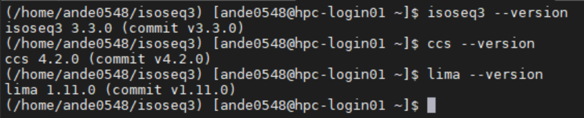

*****
FAQ 
*****

Below are some of the common steps that the team has been asked to resolve more than once, so we put them here to (hopefully) answer your questions before you have to wait in the Ticket Queue! 

Host Not Found 
===============

When attempting to connect to the HPC, you receive a message that says 'Could not find deepthought.flinders.edu.au'. 

1. If you are on campus, contact ServiceDesk via ServiceOne or Phone.
2. If you are off campus or working remotely, connect to the VPN and retry.

What are the SLURM Partitions? 
===============================
There are three at this point: 

* general 
* gpu
* melfu 

You can omit the 

* #SBATCH partition=<name> directive
    

as the sane-default for you is the general partition. If you need access to the GPU's you **must** use the gpu queue.

SLURM - Tasks & OpenMPI/MPI
===========================
When running jobs enabled with OpenMPI/MPI, there is some confusion around how it all works and what the correct settings for SLURM are. The biggest confusion is around what a 'Task' is, and when to use them.

Tasks
-----
Think of a task as a 'Bucket of Resources' you ask for. It cannot talk to another bucket without some way to communicate - this is what OpenMPI/MPI does for you. It lets any number of buckets talk to each other.

When asking SLURM for resources, when you ask for N Tasks, you will get N tasks of X size that you asked for, and all are counted against your usage. For example

* -N12 --cpus-per-task=10 --mem-per-cpu=2G

Will get you a combined *total* of 120 CPUs and 240GB of RAM *spread across 12 individual little instances*.

Running the Job
----------------
There are several ways to correctly start OpenMPI/MPI based programs. SLURM does an excellent job of integrating with OpenMPI/MPI, so usually it will 'Just Work'.  Its highly dependant upon how the program is structured and written.  Here are some options that can help you boot things when they do not go to plan.

* mpirun - bootstraps a program under MPI.  Best tested under a manual allocation via salloc.
* srun - Acts nearly the same as 'sbatch' but runs immediacy via SLURM, instead of submitting the job for later execution.

OOM Killer
-----------
Remember, that each 'task' is its own little bucket - which means that SLURM tracks it individually! If a single task goes over its resource allocation, SLURM will kill it, and usually that causes a cascade failure with the rest of your program, as you suddenly have a process missing.

Issues Installed ISoSeq3 
=====================

IsoSeq3, from Pacific Bio Sciences has install instructions that won't get you all the way on DeepThought.  There are some missing packages and some commands that must be altered to get you up and running.
This guide will assume that you are starting from scratch, so feel free to skip any steps you have already performed. 

The steps below will:

* Create a new Virtual Environment
* Install the dependencies for IsoSeq
* Install IsoSeq3
* Alter a SLURM script to play nice with Conda

Conda/Python Environment
--------------------------
Only thing you will need to decide is 'where you want to store my environment' you can store it in your /home directory if you like or in /scratch. Just put it someplace that is easy to remember.
To get you up and running (anywhere it says FAN, please substitute yours):

* module load miniconda/3.0
* conda create -p /home/FAN/isoseq3 python=3.9
* source activate /home/FAN/isoseq3
* You may get a warning saying 'your shell is not setup to use conda/anaconda correctly' - let it do its auto-configuration. Then Issue

  * source ~/.bashrc
    
When all goes well, your prompt should read something similar to

    
Notice the (/home/ande0548/isoseq3)? Thats a marker to tell you which Python/Conda Environment you have active at this point. 

BX Python 
----------
The given bx-python version in the wiki doesn't install correctly, and if it *does* work, then it will fail on run. To get a working version, run the following.

* conda install -c conda-forge -c bioconda bx-python

Which will get you a working version.

IsoSeq3 
---------

Finally, we can install IsoSeq3 and its dependencies. 

* conda install -c bioconda isoseq3 pbccs pbcoretools bamtools pysam lima

Will get you all the tools installed into your virtual environment. To test this, you should be able to call the individual commands, like so. 

SLURM Modifications
-------------------- 

You may get an issue when you ask SLURM to run your job about CONDA not being initialised correctly. This is a very-brute-force hammer approach, but it will cover everything for you. 

Right at the start of your script, add the following lines: 

* module load miniconda/3.0
* conda init --all
* source /home/FAN/.bashrc
* conda activate /path/to/conda/environment

This will load conda, initialises (all of your) conda environment(s), force a shell refresh and load that new configuration, then finally load up your environment. Your job can now run without strange conda-based initialisation errors.

BX-Python 
=========
The given bx-python is a problematic module that appears in many of the BioScience packages in Conda, below will get you a working, Python 3 version.
These steps are the same as the installation for IsoSeq3, but given how often this particular python package gives the support team issues, it gets its own section!

* conda install -c conda-forge -c bioconda bx-python

My Jupyter Kernel Times Out
===============================
This is usually caused by one of two things: 

    * HPC has allocated all its Resources 
    * Incorrect Conda Setup

HPC Is Busy
------------

You job will time out when the HPC is busy, as your job cannot get an allocation within 30 seconds (or so). 
If you do not see a file like 'slurm-<NUMBER>.out' in  your /home directory, then the HPC cannot fit your kernel's requested allocation as all resources are busy. 

To solve the above, you can either: 

* Recreate a Kernel with lower resource requirements 
* Wait for the HPC to be less busy

A sneaky command from the HPC Admin Team: ``sinfo -No "%17n %13C %10O %10e %30G"``. This gets you a layout like so:: 

    HOSTNAMES         CPUS(A/I/O/T) CPU_LOAD   FREE_MEM   GRES
    hpc-node001       0/64/0/64     0.46       241647     gpu:tesla_v100:2(S:2,6)
    hpc-node002       0/64/0/64     1.86       250777     gpu:tesla_v100:2(S:2,6)
    hpc-node003       64/0/0/64     20.44      240520     (null)
    hpc-node004       64/0/0/64     19.46      244907     (null)
    hpc-node005       64/0/0/64     18.59      241284     (null)
    hpc-node006       64/0/0/64     17.37      244390     (null)
    hpc-node007       64/0/0/64     14.50      221633     (null)
    hpc-node008       64/0/0/64     18.06      211002     (null)
    hpc-node009       64/0/0/64     19.27      206833     (null)
    hpc-node010       64/0/0/64     19.39      233411     (null)
    hpc-node011       64/0/0/64     20.51      221966     (null)
    hpc-node012       64/0/0/64     19.06      181808     (null)
    hpc-node013       64/0/0/64     20.35      221835     (null)
    hpc-node014       60/0/4/64     4.00       151584     (null)
    hpc-node015       64/0/0/64     18.01      191874     (null)
    hpc-node016       64/0/0/64     11.04      214227     (null)
    hpc-node017       0/64/0/64     0.00       512825     (null)
    hpc-node018       0/64/0/64     0.03       61170      (null)
    hpc-node019       128/0/0/128   515.85     1929048    (null)
    hpc-node020       128/0/0/128   30.31      1062956    (null)
    hpc-node021       128/0/0/128   38.10      975893     (null)
    hpc-node022       0/64/0/64     0.06       119681     gpu:tesla_v100:1(S:2)

What you want to look at is that first and second numbers in the CPUS Column. The first is 'Allocated' and the second is 'Available for Usage'. 
This above example shows that the GPU queue is empty (0/64) but the general queue is busy (64/0). 

Incorrect Conda Environment Setup 
-----------------------------------
The timeout error can also be caused by missing a required package for the custom WLM Integration to work correctly. 

This means that the job started, but could not connect your Jupyter Notebook correctly. If you look in your home directory, you will see the previously mentioned 'slurm-<NUMBER>.out' file. 
Right at the very bottom of the file (its quite long, with lots of debugging information in it) you will see a message similar to: 

* ``command not found ipykernel-wlm`` 

To fix this type of 'command not found' error for ipykernel or similar - go back to the Jupyter Hub Conda Setup instructions, and double check that you have installed *all* of the needed packages. 