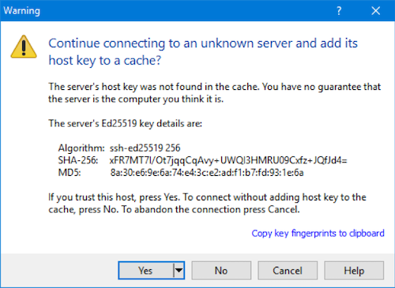
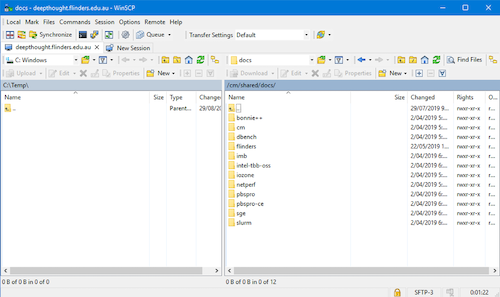

# Transferring Files to Deepthought

Transferring files to the HPC will change depending upon your OS. Thankfully, there are some excellent tools that take this from 'potentially-scary' to 'click a button or two'.

## Before we get started

The HPC is a little different that your desktop at home when it comes to storage (not just computing power!). It's a shared resource, so we cant store everybody's data for all time - there just isn't enough space!

So, we have two main storage locations we use; Linux Guru's some of this is old hat - please keep reading, it'll get to new things soon!

- /home/$FAN
- /scratch/$FAN

### /Home

Your 'home' directories. This is a small amount of storage to store your small bits and pieces. This is the analogous to the Windows 'Documents' folder.

At a command promp, your home directory usually gets shortened to ~/ - we will cover this more in the Linux Guide.

#### What to store in /home

Here is a rough guide as to what should live in your /home/$FAN directory. In general, you want small, little things is here.

- SLURM Scripts
- Results from Jobs.
- 'Small' Data-Sets (<1GB)

### /Scratch

Scratch is your working space. Whenever you are running a job, it should be running in the the /scratch area. This storage area is quicker and isolated from the others - meaning that even under high usage you are not going to slow down much (if at all) waiting to read data to or from the disks.

It's also much, much larger than your /home area. Some of the working data-sets we have seen on Deep Thought have gotten out to Multiple Terabytes! Thankfully, /scratch can handle this, however /home would not.

#### What to store in /scratch

Here is a rough guide as to what should live in your /scratch/$FAN directory. In general, anything large, bulky and only needed for a little while should go here.

- Job Working Data-sets
- Intermediate files

## Transferring Files

All file-transfers are done via Secure File Transfer Protocol (SFTP). As was the same with the 'Getting Access', pick your platform:

### Linux/Unix File Transfers

Linux / Unix based systems share native support for the SFTP Protocol. The Secure Copy Protocol (SCP) is also widely accepted, which can sometimes offer an edge in transfer speed.

#### The Windows Sub-System for Linux

Since Windows 10 and Windows Server 2019, the windows Subsystem for Linux (WSL) allows you to run a Linux Distribution as a sub-system in windows. When following these instructions, a 'terminal' is the same as starting your WSL Distribution.

#### Transferring Files to the HPC

To upload files to DeepThought, the simplest method is to open a Terminal window.

#### The Quick Version

Substitute your filename, FAN and Password, type scp FILENAME FAN@deepthought.flinders.edu.au:/home/FAN then hit enter.
Enter your password when prompted. This will put the file in your home directory on DeepThought. It looks (when substituted accordingly) similar to:

#### The Longer Version

To download files from DeepThought, you simply need to invert that command to point to either:

- A name of a Computer that Deepthough 'knows' about.
- An IP Address that Deepthought can reach.

#### Transfers By Computer Name

If you know the hostname of the computer, you can substitute this to transfer files back to your machine. The command stays the same, mostly. You still follow the same idea, we just change where we are pointing it. This one assumed you are transferring it to a Linux/Unix based machine.

The command will take this form:

#### Transfer By IP Address

If you don't know your computer IP, then the commands of:

- ip addr
- ifconfig

Will be your friend to figure out what it is. Just like above, we slightly change the command, and sub-in an IP instead of a host-name.

### Windows

Windows doesn't support the SFTP protocol in a native way. Thankfully, there are lots of clients written to do just this for us.

#### Sub-System for Linux

You can use the WSL for this - head on over to the [Linux](../Linux/LinuxFileTransfer.md) Guide.

#### Potential Client List

This is not an exhaustive list - feel free to use whatever you wish that supports the SFTP protocol.

- [WinSCP](https://winscp.net/eng/index.php)
- [FileZilla](https://filezilla-project.org/?AFFILIATE=6732&__c=1)

This guide will focus on WinSCP.

#### Getting Connected

Open WinSCP, enter deepthought.flinders.edu.au as the host to connect to, and click Login. You should have a screen that looks like this.

The first time you connect up you will get a warning - this is fine, just click YES to continue on.

A connection to Deep Thought will then be created - login using your FAN and password. If all goes well, you will be treated to this screen:

