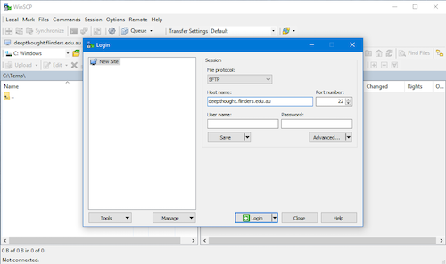

# Transferring Files to DeepThought

Transferring files to the HPC will change depending upon your OS. Thankfully, there are some excellent tools that take this from 'potentially-scary' to 'click a button or two'.  

Before we start, ensure that you have read the [Storage Overview & Usage Guidelines](../storage/storageusage.html).

## Transferring Files

All file-transfers are done via Secure File Transfer Protocol (SFTP), or Secure Copy Protocol (SCP). Other options, like the tool RSync are also usable. This guide will focus upon the GUI based tools, using SFTP.

### Where is the old r_drive? 

The old /r_drive/ mount points where a legacy implementation left over from the eRSA Project. All the data from these drives has been migrated to a /RDrive/ share with the same name, and will appear automatically. 
## Linux/Unix File Transfers

Linux / Unix based systems share native support for the SFTP Protocol. The Secure Copy Protocol (SCP) is also widely accepted, which can sometimes offer an edge in transfer speed. Tools such as RSYNC are also usable.

### The Windows Sub-System for Linux

Since Windows 10 and Windows Server 2019, the windows Subsystem for Linux (WSL) allows you to run a Linux Distribution as a sub-system in windows. When following these instructions, a 'terminal' is the same as starting your WSL Distribution.

### Transferring Files to the HPC

When using a *NIX based system, using the terminal is the fastest way to upload files to the HPC.

### The Quick Version

Substitute your filename, FAN and Password, type scp FILENAME FAN@deepthought.flinders.edu.au:/home/FAN then hit enter.
Enter your password when prompted. This will put the file in your home directory on DeepThought. It looks (when substituted accordingly) similar to:

`scp /path/to/local/file fan@deepthought.flinders.edu.au:/path/on/deepthought/hpc/`

### The Longer Version

To download files from DeepThought, you simply need to invert that command to point to either:

- A name of a Computer that DeepThought 'knows' about.
- An IP Address that DeepThought can reach.

### Transfers By Computer Name

If you know the hostname of the computer, you can substitute this to transfer files back to your machine. The command stays the same, mostly. You still follow the same idea, we just change where we are pointing it. This one assumed you are transferring it to a Linux/Unix based machine.

The command will take this form:

### Transfer By IP Address

If you don't know your computer IP, then the commands of:

- ip addr
- ifconfig

Will be your friend to figure out what it is. Just like above, we slightly change the command, and sub-in an IP instead of a host-name.

## Windows

Windows doesn't support the SFTP protocol in a native way. Thankfully, there are lots of clients written to do just this for us.

### Sub-System for Linux

You can use the WSL for this - head on over to the [Linux](#TransferringFiles) Guide.

### Potential Client List

This is not an exhaustive list - feel free to use whatever you wish that supports the SFTP protocol.

- [WinSCP](https://winscp.net/eng/index.php)
- [FileZilla](https://filezilla-project.org/?AFFILIATE=6732&__c=1)

This guide will focus on WinSCP.

### Getting Connected with WinSCP

Open WinSCP, enter deepthought.flinders.edu.au as the host to connect to, and click Login. You should have a screen that looks like this.

The first time you connect up you will get a warning - this is fine, just click YES to continue on.

A connection to Deep Thought will then be created. If all goes well, you will be treated to this screen:

You can now drag and drop files between your computer (Left-hand side) and DeepThought (Right-hand side).
