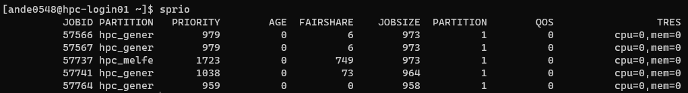
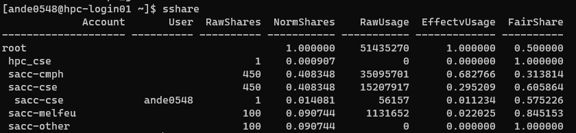

# SLURM

Slurm (Simple Linux Usage Resource Manager) is used to configure, run and otherwise manage jobs on the HPC. From the Slurm quick start guide:

"Slurm is an open source, fault-tolerant, and highly scalable cluster management and job scheduling system for large and small Linux clusters. ...

As a cluster workload manager, Slurm has three key functions. First, it allocates exclusive and/or non-exclusive access to resources (compute nodes) to users for some duration of time so they can perform work. Second, it provides a framework for starting, executing, and monitoring work (normally a parallel job) on the set of allocated nodes. Finally, it arbitrates contention for resources by managing a queue of pending work."

## System Specifications

If you want to know the system specifications for DeepThought, head on over to [here](../system/deepthoughspecifications.md)

## SLURM on DeepThought

SLURM on DeepThought uses the 'Fairshare' work allocation algorithm. This works by tracking how many resource your job takes and adjusting your position in queue depending upon your usage. The following sections will break down a quick overview of how we calculate things, what some of the cool-off periods are and how it all slots together.

In a sentence, what does this mean for you?

- Greedy users have to wait to run jobs - but only if there are people ahead of them!

What will it mean in the future?

- Greedy users will have to wait to start jobs _and_ if they are running a job with a 'non-greedy' person waiting, their job will be forcibly paused to let the other person run their job.

### SLURM Priority

The 'Priority of a job is a number you get at the end of the Fairshare calculation. This is attached to your user and is inherited by accounts(colleges). For example, a system might have 1000 'Shares' - think of them as a arbitrary concept of 'some form of computation'. Then the individual 'College' Accounts would be divvied up as needed for all the users that are within that college.  

At any point, you can check the 'live' priority scores of user accounts via the command:

    sprio 

Which will print something resembling this table:

If you want to interrogate even more data, you can explore the command:

    sshare 

Which will allow for greater details of how your score was calculated.

### Calculating Priority

SLURM tracks 'Resources'. This can be nearly anything on the HPC - CPU's, Power, GPU's, Memory, Storage, Licenses, anything that people share and could use really.

The basic premise is - you have:

- Weight
- Factor
- Unit(s)

Then you multiple all three together to get your end priority. So, lets say you ask for 2 GPU's (The current max you can ask for)

A GPU on Deepthought (When this was written) is set to have these parameters:

- Weight: 5
- Factor: 1000

So your final equation is basically:

    2 x (5 x 1000) = 10,000

There is a then a lot of math to normalize your score against capacity, current cluster utilization, other users comparative usage, how big you job is, favor status, shares available, account shares percentages and a lot more. There are _a lot_ of moving parts and its quite complicated! But why are the number so big? So that we have finer-grained priority and we can avoid 'collisions' where two individual users have the same priority number.

### Requested Vs. Utilized

This 'Fairshare' score is part of the reason why you must tailor your SLURM scripts or risk your priority hitting rock bottom.  If you ask for and entire standard node (64 CPU's + 256GB RAM) you will be 'charged' for that amount - even if you are only using a tiny percentage of those actual resources. This is a huge amount of resources, and will very quickly drop your priority!  

To give you an idea of the _initial_ score you would get for consuming an entire node, which is then influences by other factors:

**CPU**: `64 * 1 * 1000 = 64,000` (Measure Per CPU Core)

**RAM**: `256 * 0.25 * 1000 = 65,536,000` (Measured Per MB)

**Total**: `‭65,600,000`‬

So, its stacks up very quickly, and you really want to write your job to ask for what it needs, and not much more! This is not the number you see and should only be taken as an example.  If you want to read up on exactly how Fairshare works, then head on over to [here](https://slurm.schedmd.com/priority_multifactor.html).

## SLURM: The Basics

These are some of the basic commands. The Slurm [Quick-Start](https://slurm.schedmd.com/quickstart.html) guide is also very helpful to acquaint yourself with the most used commands.

Slurm has also produced the [Rosetta Stone](../_static/SLURMRosettaStone.pdf) - a document that shows equivalents between several workload managers.

### Job submission

Once the slurm script is modified and ready to run, go to the location you have saved it and run the command:

    sbatch <name of script>.sh

To test your job use:

    sbatch --test-only <name of script>.sh

This does not actually submit anything. Useful for testing new scripts for errors.

### Job information

List all current jobs for a user:

    squeue -u <username>

List all running jobs for a user:

    squeue -u <username> -t RUNNING

List all pending jobs for a user:

    squeue -u <username> -t PENDING

List all current jobs in the shared partition for a user:

    squeue -u <username> -p shared

List detailed information for a job (useful for troubleshooting):

    scontrol show jobid -dd <jobid>

### Cancelling a job

To cancel a job based on the jobid, run the command:

    scancel <jobid of the job to cancel>

To cancel a job based on the user, run the command:

    scancel -u <username of job to cancel>

To cancel all the pending jobs for a user:

    scancel -t PENDING -u <username>

To cancel one or more jobs by name:

    scancel --name myJobName

To hold a particular job from being scheduled:

    scontrol hold <jobid>

To release a particular job to be scheduled:

    scontrol release <jobid>

To requeue (cancel and rerun) a particular job:

    scontrol requeue <jobid>

## SLURM: Advanced

### Job Arrays

Job arrays is a popular strategy to process large numbers of a same workflow repetitively in one go, often reduce analytical time significantly. Job arrays are also often refereed as embarrassingly/pleasingly parallel processes. For more information, see SLURM job arrays.

To cancel an indexed job in a job array:

    scancel <jobid>_<index>

To find the original submit time for your job array:

    sacct -j 32532756 -o submit -X --noheader | uniq

The following are good for both jobs and job arrays. Commands can be combined to allow efficiency and flexibility.

Suspend all running jobs for a user (takes into account job arrays):

    squeue -ho %A -t R | xargs -n 1 scontrol suspend

Resume all suspended jobs for a user:

    squeue -o "%.18A %.18t" -u <username> | awk '{if ($2 =="S"){print $1}}' | xargs -n 1 scontrol resume

After resuming, check if any are still suspended:

    squeue -ho %A -u $USER -t S | wc -l

The following is useful if your group has its own queue and you want to quickly see usage:

    lsload |grep 'Hostname \|<partition>'

### Environmental Variables

The following varaibles are set per job, and can be access from your SLURM Scripts if needed.

|Variable Name                |   Description|
|-----------------------------|----------------|
|$SLURM_JOBID                 |   Job ID.|
|$SLURM_JOB_NODELIST          |   Nodes allocated to the job i.e. with at least once task on.|
|$SLURM_ARRAY_TASK_ID         |   If an array job, then the task index.|
|$SLURM_JOB_NAME              |   Job name.|
|$SLURM_JOB_PARTITION         |   Partition that the job was submitted to.|
|$SLURM_JOB_NUM_NODES         |   Number of nodes allocated to this job.|
|$SLURM_NTASKS                |   Number of tasks (processes) allocated to this job.|
|$SLURM_NTASKS_PER_NODE       |   (Only set if the --ntasks-per-node option is specified) Number of tasks (processes) per node.|
|$SLURM_SUBMIT_DIR            |   Directory in which job was submitted.|
|$SLURM_SUBMIT_HOST           |   Host on which job was submitted.|
|$SLURM_PROC_ID               |   The process (task) ID within the job. This will start from zero and go up to $SLURM_NTASKS-1.|

## SLURM: Extras

Here is an assortment of resources that have been passed on to the Support Team as 'Useful to me'. Your mileage may vary on how useful you find

[Slurm batch scripting](https://hpc-uit.readthedocs.io/en/latest/jobs/examples.html)

[Tasks, jobs & parallel scripting](https://www.youtube.com/watch?v=LRJMQO7Ercw)

Besides useful commands and ideas, this [FAQ](http://www.ceci-hpc.be/slurm_faq.html#Q01) has been the best explanation of 'going parallel' and the different types of parallel jobs, as well as a clear definition for what is considered a task.

An excellent guide to [submitting jobs](https://support.ceci-hpc.be/doc/_contents/QuickStart/SubmittingJobs/SlurmTutorial.html).

## SLURM: Script Template 

    #!/bin/bash
    # Please note that you need to adapt this script to your job
    # Submitting as is will fail cause the job to fail 
    # The keyword command for SLURM is #SBATCH --option
    # Anything starting with a # is a comment and will be ignored
    # ##SBATCH is a commented-out #SBATCH command
    ##################################################################
    # Change FAN to your fan account name
    # Change JOBNAME to what you want to call the job
    # This is what is shows when attempting to Monitor / interrogate the job,
    # So make sure it is something pertinent!
    #
    #SBATCH --job-name=FAN_JOBNAME
    #
    ##################################################################
    # If you want email updates form SLURM for your job.
    # Change MYEMAIL to your email address
    #SBATCH --mail-user=MYEMAIL@flinders.edu.au
    #SBATCH --mail-type=ALL
    # 
    # Valid 'points of notification are': 
    # BEGIN, END, FAIL, REQUEUE. 
    # ALL means all of these
    ##################################################################
    # Tell SLURM where to put the Job 'Output Log' text file. 
    # This will aid you in debugging crashed or stalled jobs.
    # You can capture both Standard Error and Standard Out
    # %j will append the 'Job ID' from SLURM. 
    # %x will append the 'Job Name' from SLURM 
    #SBATCH --output=/home/$FAN/%x-%j.out.txt
    #SBATCH --error=/home/$FAN/%x-%j.err.txt
    ##################################################################
    # You can leave this commented out, or submit to hpc_general
    # Valid partitions are hpc_general and hpc_melfeu
    ##SBATCH --partition=PARTITIONNAME
    #
    ##################################################################
    # Tell SLURM how long your job should run for, at most. 
    # SLURM will kill/stop the job if it goes over this amount of time. 
    # Currently, this is unlimited - however, but the longer your job 
    # runs, the worse your Fairshare score becomes! 
    # 
    # In the future this will have a limit, so best to get used to 
    # setting it now. 
    #
    # The command format is as follows: #SBATCH --time=DAYS-HOURS
    #SBATCH --time=14=0
    #
    ##################################################################
    # How many tasks is your job going to run? 
    # Unless you are running something that is Parallel / Modular or
    # pipelined, leave this as 1. Think of each task as a 'bucket of
    # resources' that stand alone. Without MPI / IPC you cant talk to 
    # another bucket!
    #
    #SBATCH --ntasks=1
    # If each task will need more that a single CPU, then alter this 
    # value. Remeber, this is multiplicative, so if you ask for 
    # 4 Tasks and 4 CPU's per Task, you will be allocated 16 CPU's 
    #SBATCH --cpus-per-task=1
    ##################################################################
    # Set the memory requirements for the job in MB. Your job will be
    # allocated exclusive access to that amount of RAM. In the case it
    # overuses that amount, Slurm will kill it. The default value is 
    # around 2GB per CPU you ask for.
    # Note that the lower the requested memory, the higher the
    # chances to get scheduled to 'fill in the gaps' between other
    # jobs. Pick ONE of the below options. They are Mutually Exclusive.
    # You can ask for X Amount of RAM per CPU (MB by default)
    #SBATCH --mem-per-cpu=4000
    # Or, you can ask for a 'total amount of RAM'
    ##SBATCH --mem=12G
    ##################################################################
    # Change the number of GPU's required and the most GPU's that can be 
    # requested is 2 per node. As there are limited GPU slots, they are heavily 
    # weighted against for Fairshare Score calculations. 
    # This line requests 0 GPU's by default.
    #
    #SBATCH --gres="gpu:0"
    ##################################################################
    # Load any modules that are required. This is exactly the same as 
    # loading them manually, with a space-separated list, or you can 
    # write multiple lines.
    # You will need to uncomment these.
    #module add miniconda/3.0 cuda10.0/toolkit/10.0.130 
    #module add miniconda/3.0 
    #module add cuda10.0/toolkit/10.0.130 

    ##################################################################
    # If you have not already transferred you data-sets to your /scratch 
    # directory, then you can do so as a part of you job.
    # Change the FAN and JOBNAME as needed.
    # REMOVE the data from /home when you do not need it, as /home space is
    # limited.

    # Copy Data to /scratch
    cp -r /home/$FAN/??DataDirectory?? /scratch/user/FAN/JOBNAME

    ##################################################################
    # Enter the command-line arguments that you job needs to run. 
    cd /scratch/user/$FAN/
    python36 Generator.py

    ##################################################################
    # Once you job has finished its processing, copy back your results 
    # and ONLY the results from /scratch. 

    cp /scratch/user/FAN/JOBNAME/??ResultsOutput.txt?? ~/JOBNAME/

    # Now, cleanup your /scratch directory of the extra data you have. 
    # If you need to keep the data-set for later usage, then utilise
    # your prefered method to get it OFF the HPC, and into your
    # local storage.
    rm -rf /scratch/user/FAN/JOBNAME
    ##################################################################
    # Print out the 'Job Efficiency' - this is how well your job used the
    # resources you asked for. The higher the better!
    seff $SLURM_JOBID
