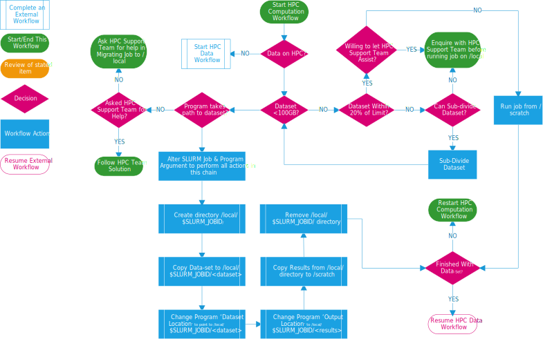

*******************
HPC Job Data Flow
*******************

To run jobs in an efficient manner on the HPC, there is usually some additional preparation work required. The below diagram will aid you in ascertaining
what steps to take to ensure that you run your jobs in the quickest manner. 

Depending on your view-screen size 
you may wish to Right Click -> Open Image in New Tab to view the diagram correctly. 

    DeepThought HPC Job Data Flow Diagram

.. note:: If you have any questions, please reach out to the support team at deepthought@flinders.edu.au