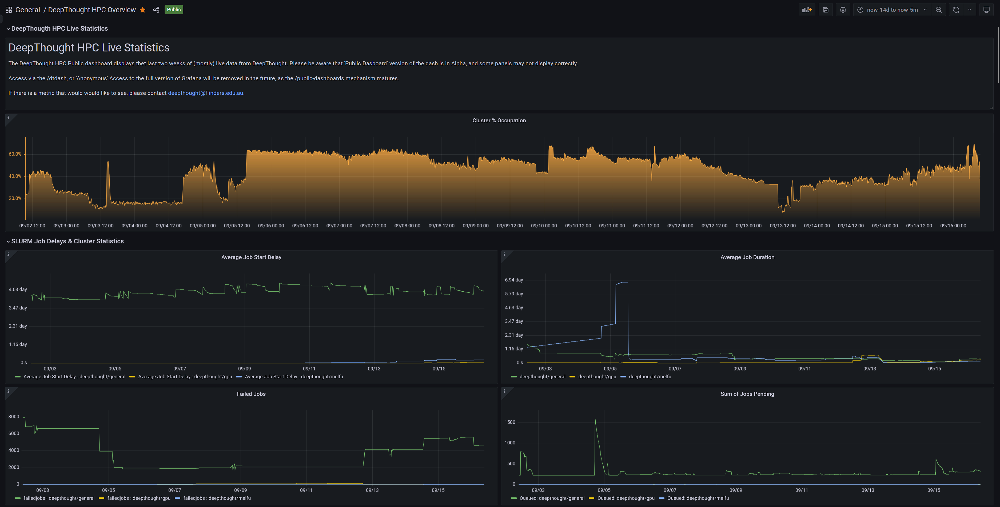

Welcome to the DeepThought HPC
=========================================

The new Flinders University HPC is called DeepThought. This new HPC comprises of AMD EPYC based hardware and next-generation management software, allowing for a dynamic and agile HPC service. 

.. attention:: 
    The new HPC Dashboard has been released. The default, 2-Week Window 'Quick View' can be accessed at https://deepweb.flinders.edu.au/,
    https://deepweb.flinders.edu.au/public-dashboards/9f967160b3d0441c8fe9c7eee9f231c5, or https://deepweb.flinders.edu.au/dtdash/. 
    Be advised the the 'full' version ('/dtdash') will be removed in the future. 

.. attention::
    This documentation is under active development, meaning that it can
    change over time as we improve it. Please email deepthought@flinders.edu.au if
    you require assistance. We also welcome user contributions  to this documentation 
    - contact the same email above so we can grant you access.

Attribution
----------------------

If you use the HPC to form a part of your research, you should attribute your usage. 
Flinders has minted a DOI that points to this documentation, specific for the HPC Service. It will also allow for tracking the research outputs that the HPC has contributed to.  

Text Citation 
++++++++++++++

.. _ARDC Data Citation: https://ardc.edu.au/resources/working-with-data/citation-identifiers/data-citation/

The below text citation follows the standard Australian Research Data Commons (ARDC) format for attributing data and software. For more information on this type of attribution, 
visit the `ARDC Data Citation`_ page. 

``Flinders University (2021). DeepThought (HPC). Retrieved from https://doi.org/10.25957/FLINDERS.HPC.DEEPTHOUGHT``

Reference Managers
+++++++++++++++++++

The following files are provided for integration into your reference manager of choice. To save the file, 'Right Click -> Save Link As..'. 

.. _BibTex: https://raw.githubusercontent.com/flindersuni/DeepThoughtHPC-docs/master/docs/source/flindershpc2021-bibtex.bib
.. _EndNote: https://raw.githubusercontent.com/flindersuni/DeepThoughtHPC-docs/master/docs/source/flindershpc2021-endnote.xml
.. _RIS: https://raw.githubusercontent.com/flindersuni/DeepThoughtHPC-docs/master/docs/source/flindershpc2021-ris.ris

- BibTex_ 
- EndNote_
- RIS_

.. _Default URL: https://deepweb.flinders.edu.au/
.. _Public Dashboard: https://deepweb.flinders.edu.au/public-dashboards/9f967160b3d0441c8fe9c7eee9f231c5
.. _Full Version: https://deepweb.flinders.edu.au/dtdash

HPC Visual Dashboard
+++++++++++++++++++++++++++
DeepThought has a time-series based visual statistics dashboard that be viewed via a web-browser while on campus.  

THe 'Default' and 'Public' URL's are using an *Alpha Release* feature set, and may not display correctly. In that case, please use the 
'Full Version' link, and any display strangeness will be resolved. 

The following URLS all link to the dashboard. 

1. `Default URL`_ 
2. `Public Dashboard`_ 
3. `Full Version`_  

The 'Full Version' has the capability to change the time-period viewed, and will be removed when the 'Public' and 'Default' feature set reach 
maturity. 

A screen shot of a small portion of the Dashboard is below.

Table of Contents
====================

.. toctree::
    :maxdepth: 1
    :caption: User Documentation
 
    Access/accessrequest.rst
    Access/windows.rst
    Access/unix.rst
    storage/storageusage.rst
    dataflow/hpcresearchdataflow.rst
    FileTransfers/FileTransfersIntro.md
    LinuxCommands/LinuxIntro.md
    dataflow/hpcjobdataflow.rst
    SLURM/SLURMIntro.md
    ModuleSystem/LMod.md
    
.. toctree:: 
    :maxdepth: 1 
    :caption: Software Suites

    software/softwaresuitesoverview.rst
    software/ansys.rst
    software/cststudio.rst
    software/delft3d.rst 
    software/gromacs.rst
    software/jupyter.rst
    software/lammps.rst
    software/matlab.rst
    software/singularity.rst
    software/vasp.rst
    software/opendatacube.rst
    
 
.. toctree::
    :maxdepth: 1
    :caption: Technical Specifications
 
    system/deepthoughspecifications.md

.. toctree::
    :maxdepth: 1
    :caption: FAQ & Known Issues
 
    FAQ/faq.rst
    FAQ/knownissues.rst
 

.. toctree::
   :maxdepth: 1
   :caption: Software & Support Policies

   policies/fairuse.rst
   policies/accessandpermissions.rst
   migration/upgrademigration.rst
   upgrades/updatelog.rst

Acknowledgements
----------------

We recognise the respect the trademarks of all third-party providers referenced in this documentation. Please see the respective EULAs for software packages used in configuring your own environment based on this knowledgebase.

License
----------

This documentation is released under the `Creative-Commons: Attribution-ShareAlike 4.0 International <http://creativecommons.org/licenses/by-sa/4.0/>`_ license.
