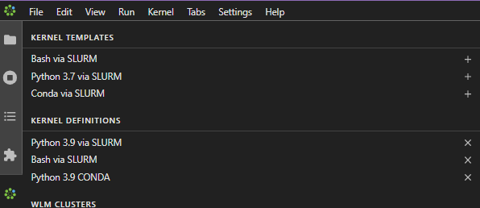

------------
Jupyter Hub
------------

==============
Jupyter Status
==============
Released and accessible to all HPC Users at the correct URLs. 

.. _Jupyter Enterprise Gateway: https://jupyter.org/hub
.. _Jupyter URL: https://deepweb.flinders.edu.au/jupyter

==================
Jupyter Overview
==================
The `Jupyter Enterprise Gateway`_ is a multi-user environment for Jupyter Notebooks. DeepThought has integrated 
the Jupyter Gateway to allow users to run jobs on the cluster via the native Web Interface.  

If you have access to the HPC, you automatically have access to the Jupyter Lab. You can the JupyterLab Instance 
via the following `Jupyter URL`_ or manually via https://deepweb.flinders.edu.au/jupyter. Your credentials are the
the same as the HPC, your FAN and password.

If you are a student with access to the HPC, the above URLs may not work - the URL http://deepteachweb.flinders.edu.au/jupyter is guaranteed to work correctly. 

========================================
Using Conda Environments in Jupyter Hub
========================================

You can use your own custom environment in a Jupyter Kernel. There are some restrictions on python versions that must be adhered to for this integration to work 
correctly. You will also need to install some specific packages. This process of enabling a Conda environment to work with the HPC, SLURM and Jupyter Hub is detailed below. 

^^^^^^^^^^^^^^^^^^^^^^^^^^^^^^^^
Python Version Restrictions
^^^^^^^^^^^^^^^^^^^^^^^^^^^^^^^^

 * Python Version <= 3.9.  

Python 3.10 *will* **not** *work*, due to dependency incompatibility. Specifically, there was a change in the PyCrypto and HTML packages.

^^^^^^^^^^^^^^^^^^^^^^^^^^^^^^^^
Conda Environment Preparation
^^^^^^^^^^^^^^^^^^^^^^^^^^^^^^^^

1. Ensure you have a named Conda environment that is loadable by ``conda activate <ENVIRONMENT_NAME>``
2. Ensure that the python version used by the environment is Python 3.9 or less.'
3. Log onto the HPC via SSH and activate your Conda environment ``conda activate <ENVIRONMENT_NAME>`` (You can also use the JupyterHub 'Terminal' to do this)
4. Execute the following commands: 
    a. ``python3 -m pip install cm-jupyter-eg-kernel-wlm`` 
    b. ``conda install ipython ipython_genutils``
5. Log into Jupyter Hub with your FAN and password at the `Jupyter URL`_
6. Using the bar on the Left-hand side, select small green symbol
7. Create a new Kernel based on the 'CONDA via SLURM' template. 
    a. Ensure you select any additional modules you need, like GDAL 
    b. Ensure that you select the correct Conda environment to initialise 
8. Use the Kernel in your Jupyter Notebooks

For Reference, the below image shows the Kernel Template Screen. 

    

^^^^^^^^^^^^^^^^^^^^^^^^^^^^^^^^^^^^^^^^^^^^
Tensorflow / GPU Usage via Jupyter Hub
^^^^^^^^^^^^^^^^^^^^^^^^^^^^^^^^^^^^^^^^^^^^

++++++++++++++++++++++++++++++++++++++
Conda Environment & Tensorflow Install 
++++++++++++++++++++++++++++++++++++++

It possible to use the GPU nodes and access the GPU's via the JupyterHub Interface. In this example, Tensorflow is used as the GPU-Enabled package of choice. To access the GPUs
from your Conda environment and use Tensorflow, perform the following steps: 

1. Follow the 'Conda Environement Preparation' steps up to step 4.
2. Run the following commands to install Tensorflow. **DO NOT** use ``conda install tensorflow``, as it has issues with GPU detection. You *must* use pip.
    a. ``python3 -m pip install tensorflow`` 

There are a few known issues that can occur here, however the main on is solved below:

1. An error about HTML has not attribute 'parser' or similar. This is usually resolved by upgrade pip. 
    a. ``python3 -m pip install --upgrade pip`` 

Try and re-install Tensorflow as above. If it still fails, upgrade the rest of the installation tooling for python:

1. ``python3 -m pip install --upgrade setuptools`` 
2. ``python3 -m pip install --upgrade distlib`` 

And once again attempt to Install Tensorflow. If you are still having issues, then reach out to deepthought@flinders.edu.au 

Now that the environment is up and running, create a new Kernel Templace from the JupyterHub GUI. For CUDA access you must load the following modules.
Alter the version numbers as needed. 

* cuda1X.X/toolkit 
* cuDNN 

If you do not add these modules to the modules list, then you will not be able to use CUDA processing, even if you allocate yourself GPUs on the cluster. 

All done! You should now be able to run the following commands from your Jupyter notebook and have Tensorflow return back GPU's in its visible devices list and return a Tensor. 

* ``python3 -c "import tensorflow as tf; print(tf.config.list_physical_devices('GPU'))"``

* ``python3 -c "import tensorflow as tf; print(tf.reduce_sum(tf.random.normal([1000, 1000])))"``
